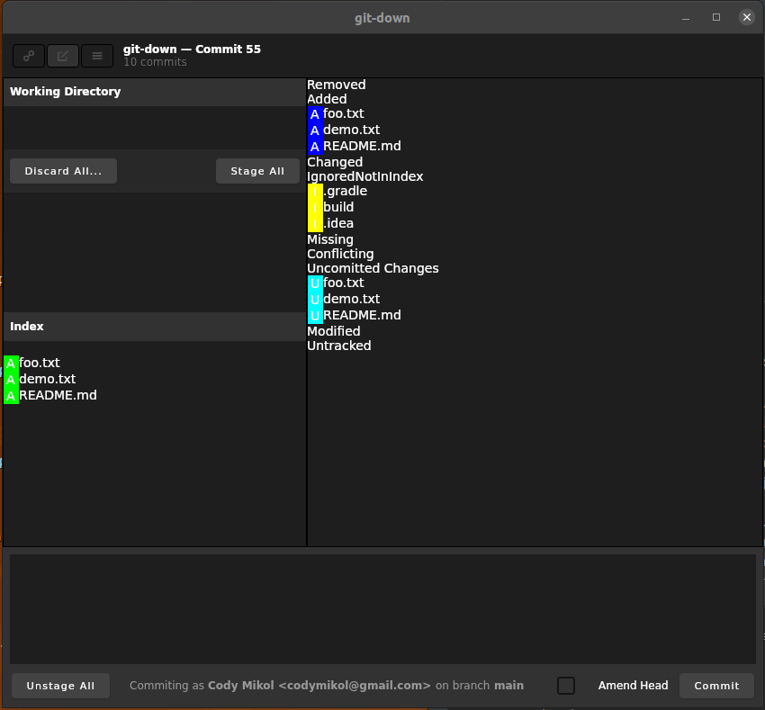

## GitDown

This is a rewrite from the ground up of the popular GitUp
library available on Mac. It is built using Kotlin and 
Compose Desktop from Jetbrains.

The big benefit of this project is that it is multiplatform.
I'm actually doing all development on a Linux machine,
but in this should work on Windows and Mac as well.

I wouldn't recommend trying to use this for any real
world projects until I have a stable release published.

I'm also using the application itself as my primary Git
companion along the way so that all the irksome bugs
will gnaw away at me until I fix them, not to mention
complete lack of features at this point.

As you can see this is still in early development and
only a few bits and bops here and there are functional

Things that are working so far ( so you don't waste much time debating on whether you should use this atm )

#### Commit View

- [x] Working Directory shows modified files
- [x] Working Directory shows deleted files
- [x] Working directory shows added files
- [x] index shows modified files
- [x] index shows deleted files
- [x] index shows added files
- [ ] index shows renamed files
- [x] commit functionality for staged items
- [x] amend head functionality
- [x] stage all functionality
- [x] unstage all functionality 
- [ ] diff viewer ( in general )
- [ ] multi file diff
- [ ] stage diff lines
- [ ] unstage diff lines
- [ ] view in diff tool
- [ ] view in file browser
- [ ] open file
- [ ] stage file
- [ ] unstage file
- [ ] discard line changes
- [ ] working directory empty state
- [ ] index empty state
- [ ] commit area guidelines

#### Stash View

Sort this out once commit view is semi usable

#### Map View

Sort this out when stash view is semi usable